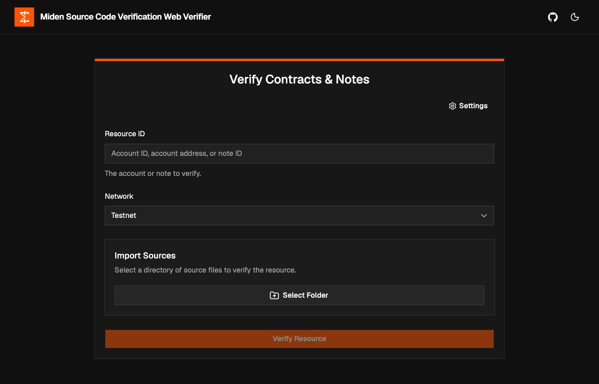

# Miden Source Code Verification



Miden Source Code Verification is a set of self-hostable services for verifying that on-chain Miden accounts and notes correspond to specific Rust source packages.

## Architecture overview

A small set of services that can be deployed independently or together:

1. **Compilation & Verification API** (`apps/api-compile`) — stateless, compute-heavy, Rust-in-container. Compiles a Rust source package and checks it against an on-chain account/note.
2. **Verified Accounts & Notes Registry API** (`apps/api-registry`) — stateful, Node.js + Postgres. Delegates compilation to (1) and persists verified results.
3. **Accounts & Notes Verifier UI** (`apps/web-verifier`) — a static Vite/React webapp where a user submits a resource ID plus a source directory to verify; talks to (2).
4. **Verified Accounts & Notes Registry UI** — static webapp for browsing verified results, talking to (2). _(planned)_

The registry never compiles or verifies on its own; it always delegates to the Compilation API and persists the result. This keeps the heavy Rust toolchain isolated from the database tier.

Verified results are keyed by the resource's on-chain **code** — an account's code root or a note's script root — rather than by a specific account/note ID. So once any resource with a given code has been verified, every other account or note sharing that same code resolves as verified too, without needing to re-submit its source.

## Repository layout

This is a [pnpm](https://pnpm.io) workspace monorepo (`pnpm-workspace.yaml`). Each service is a package under `apps/`:

| Path | Service | Port | Stack |
|------|---------|------|-------|
| `apps/api-compile` | Compilation & Verification API | `8080` | Rust toolchain in a container |
| `apps/api-registry` | Registry API | `8081` | Express + Drizzle/Postgres |
| `apps/web-verifier` | Verifier UI | `5173` | Vite + React SPA (served by nginx in Docker) |
| `apps/api-docs` | OpenAPI / Swagger UI docs | `8082` | Generated from `api-registry` annotations |
| `apps/*-cloudflare` | Cloudflare Workers deploy wrappers | — | Opt-in; wrap the matching service |
| `packages/utils` | Shared utilities (e.g. `Cargo.toml` parsing) | — | Used by the API services |
| `packages/test-utils` | Shared test helpers | — | Used by the API test suites |

Every package is named `miden-source-code-verification-<dir>` (e.g. `miden-source-code-verification-web-verifier`) — that's the value `pnpm --filter` expects.

## Getting started

### Prerequisites

- [Docker](https://docs.docker.com/get-docker/) with Compose v2 (`docker compose`, BuildKit enabled by default).
- For host-side development (optional): [Node.js](https://nodejs.org) 24+ and [pnpm](https://pnpm.io) (`corepack enable`).

### Run the full stack

From the repository root:

```bash
docker compose up --build
```

This builds and starts everything in the right order:

1. **postgres** — the database.
2. **api-registry-migrate** — a one-shot job that applies the Drizzle migrations, then exits.
3. **api-compile** (`http://localhost:8080`) — compilation & verification API.
4. **api-registry** (`http://localhost:8081`) — the registry API, started only after the migration succeeds and `api-compile` is healthy.
5. **web-verifier** (`http://localhost:5173`) — the verifier UI, started only after `api-registry` is healthy.

No `.env` files are required — the compose file ships sensible dev defaults.

> **First build is slow.** `api-compile` bundles a full Rust toolchain and pre-builds the Miden tooling, so the initial build can take tens of minutes. Subsequent builds are cached and fast.

Once it's up, **open http://localhost:5173** to use the verifier, and/or hit the APIs directly:

```bash
curl http://localhost:8080/   # api-compile
curl http://localhost:8081/   # api-registry
```

The verifier UI calls the registry at `http://localhost:8081` by default; you can point it elsewhere at runtime via the in-app **Settings** dialog.

Postgres is exposed on host port **5433** (override with `POSTGRES_PORT`) to avoid clashing with a local Postgres.

### Stop

```bash
docker compose down       # stop the stack
docker compose down -v    # also wipe the database volume
```

### Develop a service outside Docker (optional)

Run the parts you're _not_ editing in Docker, and the one you _are_ editing on the host. Install once at the root:

```bash
pnpm install
```

**Verifier UI (`web-verifier`).** Start the backend in Docker, then the Vite dev server on the host:

```bash
docker compose up -d api-registry   # also starts postgres, the migration job and api-compile
pnpm --filter miden-source-code-verification-web-verifier dev   # http://localhost:5173
```

**Registry API (`api-registry`).** It needs Postgres + api-compile reachable, so start those first:

```bash
cp apps/api-registry/.env.example apps/api-registry/.env   # then edit as needed
docker compose up -d postgres api-compile
pnpm --filter miden-source-code-verification-api-registry dev
```

(The defaults in `.env.example` expect Postgres on `localhost:5433` and api-compile on `localhost:8080`, matching the compose stack above.)

### Useful commands

Run from the repository root — each fans out across every workspace package:

```bash
pnpm test         # run all test suites (Vitest)
pnpm lint         # Biome lint + format check
pnpm format       # apply Biome fixes
pnpm typecheck    # type-check every package
pnpm build        # build every package
```

> The `api-registry` test suite talks to Postgres, so start it first: `docker compose up -d postgres`.

## API documentation

Interactive OpenAPI (Swagger UI) docs for the **Registry API** are published live at:

**https://walnuthq.github.io/miden-source-code-verification/**

The docs are generated from the `api-registry` route annotations by the `api-docs` app and deployed to GitHub Pages. To preview them locally:

```bash
pnpm --filter miden-source-code-verification-api-docs dev   # serves the docs at http://localhost:8082
```

## Deployment

The services run anywhere Docker does — see the `Dockerfile` in each `apps/*` service (including `apps/web-verifier`, which builds to a small nginx image).

A [Cloudflare Workers](https://workers.cloudflare.com) deployment path is also provided via dedicated, opt-in packages:

```bash
pnpm --filter miden-source-code-verification-api-compile-cloudflare cf:deploy
pnpm --filter miden-source-code-verification-api-registry-cloudflare cf:deploy
pnpm --filter miden-source-code-verification-web-verifier-cloudflare cf:deploy
```

These wrap the vendor-neutral services; deleting them removes Cloudflare with no impact on the core apps. On push to `main`, a dedicated workflow per service deploys it automatically — and only when that service is affected:

- `.github/workflows/deploy-api-compile-cloudflare.yml`
- `.github/workflows/deploy-api-registry-cloudflare.yml`
- `.github/workflows/deploy-web-verifier-cloudflare.yml`

Each runs only when its own `apps/<service>/**` or `apps/<service>-cloudflare/**` paths change (or a shared `pnpm-lock.yaml` / `pnpm-workspace.yaml`), so an unrelated change never redeploys every service. Each can also be triggered manually via `workflow_dispatch`, and all require the `CLOUDFLARE_API_TOKEN` and `CLOUDFLARE_ACCOUNT_ID` repository secrets.

## License

MIT
