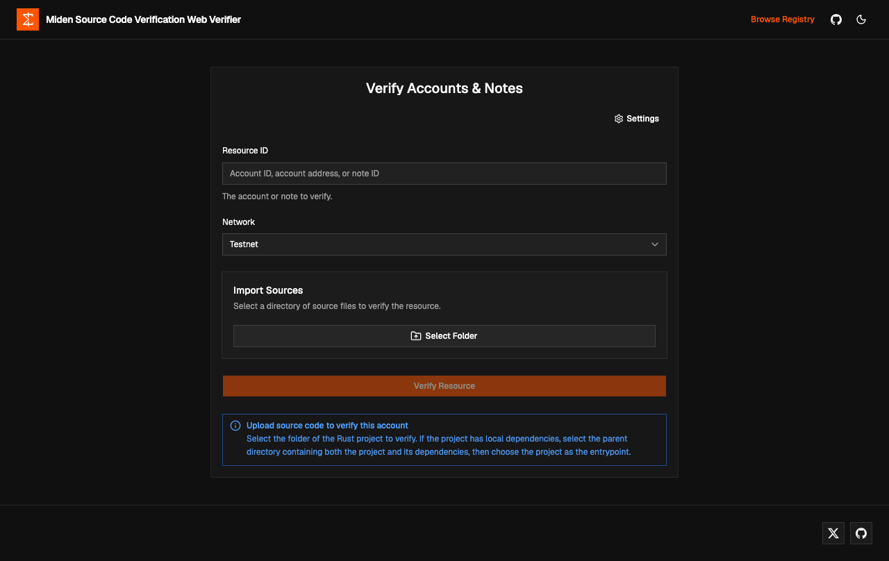

# Miden Source Code Verification



Miden Source Code Verification is a set of self-hostable services for verifying that on-chain Miden accounts and notes correspond to specific Rust source packages.

## Architecture overview

A small set of services that can be deployed independently or together:

1. **Compilation & Verification API** (`apps/api-compile`) — stateless, compute-heavy, Rust-in-container. Compiles a Rust source package and checks it against an on-chain account/note.
2. **Verified Accounts & Notes Registry API** (`apps/api-registry`) — stateful, Node.js + Postgres. Delegates compilation to (1) and persists verified results.
3. **Accounts & Notes Verifier UI** (`apps/web-verifier`) — a static Vite/React webapp where a user submits a resource ID plus a source directory to verify; talks to (2). From the selected directory it uploads what the [`miden-verify`](https://github.com/walnuthq/miden-verify) CLI does: `Cargo.toml`, `Cargo.lock`, `build.rs`, `miden-project.toml`, `rust-toolchain.toml`, `.cargo/config.toml` and everything under `src/`, skipping `target/` and hidden folders. Verifications it submits are recorded with the source `web-verifier`.
4. **Verified Accounts & Notes Viewer UI** (`apps/web-viewer`) — a server-rendered React Router (Vite) webapp for browsing verified results, talking to (2). Each verified account or note gets a page (`/{networkId}/verified-accounts/{accountId}`, `/{networkId}/verified-notes/{noteId}`) with its verification status and, for every verified package, its details (digest, procedures, dependencies, when and from which client it was verified) and a browsable, downloadable copy of its source code.

The registry never compiles or verifies on its own; it always delegates to the Compilation API and persists the result. This keeps the heavy Rust toolchain isolated from the database tier.

Verified results are keyed by the network plus the resource's on-chain **code** — an account's code root or a note's script root — rather than by a specific account/note ID. So once any resource with a given code has been verified on a network, every other account or note on that network sharing that same code resolves as verified too, without needing to re-submit its source. A code root is only meaningful within the network it was read from, so records never cross networks: the same code verified on `mtst` and on `mdev` is two records.

That `(networkId, code)` pair is the registry's real key, so it's addressable directly: `GET /v1/{networkId}/verified-accounts/code/{code}` and `GET /v1/{networkId}/verified-notes/script/{script}` return a record with a single database query and no on-chain lookup. The id-keyed reads (`GET /v1/{networkId}/verified-accounts/{accountId}`, `GET /v1/{networkId}/verified-notes/{noteId}`) are convenience resolvers on top: they ask the Compilation API for the resource's code first, then serve the same record with the queried id echoed back. Callers that already know the code should use the code-keyed endpoints — one less API call per read.

### Compiling: queue, timeouts and lockfiles

- **One build at a time.** Builds share cargo's target directory, whose lock runs them one after another anyway. Up to 8 more requests wait in a queue; past that, `POST /compile` and `POST /verify` answer `503` with `Retry-After: 30`. Both limits are set by `COMPILE_CONCURRENCY` and `COMPILE_QUEUE_SIZE`. A request whose client disconnects leaves the queue, or has its build stopped.
- **Every step is time-limited.** The build gets 240 s and the other tools 60 s. On Cloudflare, the Worker in front of the container also gives up with a `504` after 90 s for `GET /`, 120 s for imports and 420 s for compiles.
- **The lockfile comes back.** A successful `POST /compile` or `POST /verify` returns `files`: the submitted sources plus the `Cargo.lock` the build used, keyed by its path in the project. Send it with the next compile to get the same dependency versions. Without a lockfile, every build re-resolves the latest compatible versions, which takes 10–20 s; with one, a cached build takes under a second. The registry stores this `files` map with each new package, so a verified package always records the dependency versions that produced its digest.
- **Nothing is left behind.** Each request's copy of the project and its build output are deleted once it's answered. On `SIGTERM`, api-compile stops taking requests, finishes the ones in flight, then exits.
- **Outages are reported as outages.** When api-compile is unreachable, busy or too slow, the registry answers `502`, `503` (keeping `Retry-After`) or `504`, instead of a `500`, or a `404` on the id-keyed reads. The web-verifier retries a `503` up to 3 times, showing a countdown.

## Repository layout

This is a [pnpm](https://pnpm.io) workspace monorepo (`pnpm-workspace.yaml`). Each service is a package under `apps/`:

| Path | Service | Port | Stack |
|------|---------|------|-------|
| `apps/api-compile` | Compilation & Verification API | `8080` | Rust toolchain in a container |
| `apps/api-registry` | Registry API | `8081` | Express + Drizzle/Postgres |
| `apps/web-verifier` | Verifier UI | `5173` | Vite + React SPA (served by nginx in Docker) |
| `apps/web-viewer` | Viewer UI | `5174` | React Router (Vite) with server rendering (`react-router-serve` in Docker) |
| `apps/api-docs` | OpenAPI / Swagger UI docs | `8082` | Generated from `api-registry` annotations |
| `apps/status-page` | Public service status page | `4173` | Vite + React SPA; probed at build time |
| `apps/*-cloudflare` | Cloudflare Workers deploy wrappers | — | Opt-in; wrap the matching service |
| `packages/ui` | Shared design system (shadcn `base-lyra`) | — | Used by `web-verifier`, `web-viewer` and `status-page` |
| `packages/utils` | Shared utilities (`Cargo.toml` parsing, networks, Resource ID parsing, compiled package manifest types) | — | Used by the API services, `web-verifier` and `web-viewer` |
| `packages/test-utils` | Shared test helpers | — | Used by the API test suites |

Every package is named `miden-source-code-verification-<dir>` (e.g. `miden-source-code-verification-web-verifier`) — that's the value `pnpm --filter` expects.

## Getting started

### Prerequisites

- [Docker](https://docs.docker.com/get-docker/) with Compose v2 (`docker compose`, BuildKit enabled by default).
- For host-side development (optional): [Node.js](https://nodejs.org) 24+ and [pnpm](https://pnpm.io) (`corepack enable`).

### Run the full stack

From the repository root:

```bash
docker compose up --build
```

This builds and starts everything in the right order:

1. **postgres** — the database.
2. **api-registry-migrate** — a one-shot job that applies the Drizzle migrations, then exits.
3. **api-compile** (`http://localhost:8080`) — compilation & verification API.
4. **api-registry** (`http://localhost:8081`) — the registry API, started only after the migration succeeds and `api-compile` is healthy.
5. **web-verifier** (`http://localhost:5173`) — the verifier UI, started only after `api-registry` is healthy.
6. **web-viewer** (`http://localhost:5174`) — the viewer UI for browsing verified accounts and notes, started only after `api-registry` is healthy.

No `.env` files are required — the compose file ships sensible dev defaults.

> **First build is slow.** `api-compile` bundles a full Rust toolchain and pre-builds the Miden tooling, so the initial build can take tens of minutes. Subsequent builds are cached and fast.

Once it's up, **open http://localhost:5173** to use the verifier and **http://localhost:5174** to browse verified accounts and notes, and/or hit the APIs directly:

```bash
curl http://localhost:8080/   # api-compile
curl http://localhost:8081/   # api-registry
```

The verifier UI calls the registry at `http://localhost:8081` by default; you can point it elsewhere at runtime via the in-app **Settings** dialog.

Postgres is exposed on host port **5433** (override with `POSTGRES_PORT`) to avoid clashing with a local Postgres.

### Stop

```bash
docker compose down       # stop the stack
docker compose down -v    # also wipe the database volume
```

### Develop a service outside Docker (optional)

Run the parts you're _not_ editing in Docker, and the one you _are_ editing on the host. Install once at the root:

```bash
pnpm install
```

**Verifier UI (`web-verifier`).** Start the backend in Docker, then the Vite dev server on the host:

```bash
docker compose up -d api-registry   # also starts postgres, the migration job and api-compile
pnpm --filter miden-source-code-verification-web-verifier dev   # http://localhost:5173
```

**Viewer UI (`web-viewer`).** The React Router dev server renders pages on the server with hot reload. Pages are rendered from the registry, which the server reads from `API_REGISTRY_URL` (default `http://localhost:8081`, the compose stack's registry):

```bash
docker compose up -d api-registry   # also starts postgres, the migration job and api-compile
pnpm --filter miden-source-code-verification-web-viewer dev   # http://localhost:5174
```

**Registry API (`api-registry`).** It needs Postgres + api-compile reachable, so start those first:

```bash
cp apps/api-registry/.env.example apps/api-registry/.env   # then edit as needed
docker compose up -d postgres api-compile
pnpm --filter miden-source-code-verification-api-registry dev
```

(The defaults in `.env.example` expect Postgres on `localhost:5433` and api-compile on `localhost:8080`, matching the compose stack above.)

### Useful commands

Run from the repository root — each fans out across every workspace package:

```bash
pnpm test         # run all test suites (Vitest)
pnpm lint         # Biome lint + format check
pnpm format       # apply Biome fixes
pnpm typecheck    # type-check every package
pnpm build        # build every package
```

> The `api-registry` test suite talks to Postgres, so start it first: `docker compose up -d postgres`.

## API documentation

Interactive OpenAPI (Swagger UI) docs for the **Registry API** are published live at:

**https://walnuthq.github.io/miden-source-code-verification/**

The docs are generated from the `api-registry` route annotations by the `api-docs` app and deployed to GitHub Pages. To preview them locally:

```bash
pnpm --filter miden-source-code-verification-api-docs dev   # serves the docs at http://localhost:8082
```

## Status page

Liveness and the `/` payloads of the three deployed services are published at:

**https://walnuthq.github.io/miden-source-code-verification/status/**

Checks run every 30 minutes from GitHub Actions and the page is a snapshot of the
last run — see `apps/status-page`. Both it and the API docs are published to
GitHub Pages by the single `Deploy Pages` workflow.

## Deployment

The services run anywhere Docker does — see the `Dockerfile` in each `apps/*` service (including `apps/web-verifier`, which builds to a small nginx image).

A [Cloudflare Workers](https://workers.cloudflare.com) deployment path is also provided via dedicated, opt-in packages:

```bash
pnpm --filter miden-source-code-verification-api-compile-cloudflare cf:deploy
pnpm --filter miden-source-code-verification-api-registry-cloudflare cf:deploy
pnpm --filter miden-source-code-verification-web-verifier-cloudflare cf:deploy
pnpm --filter miden-source-code-verification-web-viewer-cloudflare cf:deploy
```

These wrap the vendor-neutral services; deleting them removes Cloudflare with no impact on the core apps. api-compile runs as a single Cloudflare Container (`max_instances: 1`, instance type `standard-2`: 1 vCPU, 6 GiB of memory, 12 GB of disk), set in `apps/api-compile-cloudflare/wrangler.jsonc`. On push to `main`, a dedicated workflow per service deploys it automatically — and only when that service is affected:

- `.github/workflows/deploy-api-compile-cloudflare.yml`
- `.github/workflows/deploy-api-registry-cloudflare.yml`
- `.github/workflows/deploy-web-verifier-cloudflare.yml`
- `.github/workflows/deploy-web-viewer-cloudflare.yml`

Each runs only when its own `apps/<service>/**` or `apps/<service>-cloudflare/**` paths change (or a shared `pnpm-lock.yaml` / `pnpm-workspace.yaml`), so an unrelated change never redeploys every service. Each can also be triggered manually via `workflow_dispatch`, and all require the `CLOUDFLARE_API_TOKEN` and `CLOUDFLARE_ACCOUNT_ID` repository secrets.

### Front-end URLs on Cloudflare

The two front-ends have localhost defaults. Their production URLs are set in the repository, so a deploy needs no configuration in the Cloudflare dashboard:

| App            | Variable                | Default                 | Kind       | Production value set in                           |
| -------------- | ----------------------- | ----------------------- | ---------- | ------------------------------------------------- |
| `web-verifier` | `VITE_API_REGISTRY_URL` | `http://localhost:8081` | build time | `cf:deploy` in `apps/web-verifier-cloudflare/package.json` |
| `web-verifier` | `VITE_WEB_VIEWER_URL`   | `http://localhost:5174` | build time | `cf:deploy` in `apps/web-verifier-cloudflare/package.json` |
| `web-viewer`   | `VITE_WEB_VERIFIER_URL` | `http://localhost:5173` | build time | `cf:deploy` in `apps/web-viewer-cloudflare/package.json`   |
| `web-viewer`   | `VITE_EXPLORER_TESTNET_URL` | `https://testnet.midenscan.com` | build time | `cf:deploy` in `apps/web-viewer-cloudflare/package.json` |
| `web-viewer`   | `VITE_EXPLORER_DEVNET_URL`  | `https://devnet.midenscan.com`  | build time | `cf:deploy` in `apps/web-viewer-cloudflare/package.json` |
| `web-viewer`   | `API_REGISTRY_URL`      | `http://localhost:8081` | runtime    | `vars` in `apps/web-viewer-cloudflare/wrangler.jsonc`      |

To point a deploy elsewhere, edit these files, not the dashboard:

- **Build-time (`VITE_*`) variables** are baked into the bundles when `cf:deploy` builds the app in GitHub Actions. Cloudflare only receives the built files, so a Worker variable set in the dashboard never reaches them.
- **Runtime variables** come from `vars` in `wrangler.jsonc`. `wrangler deploy` overwrites any variable set in the dashboard with those values. For `wrangler dev`, override them in the package's `.dev.vars`.

The `VITE_*` variables are also `--build-arg`s of the `web-verifier` and `web-viewer` Docker images.

## License

MIT
